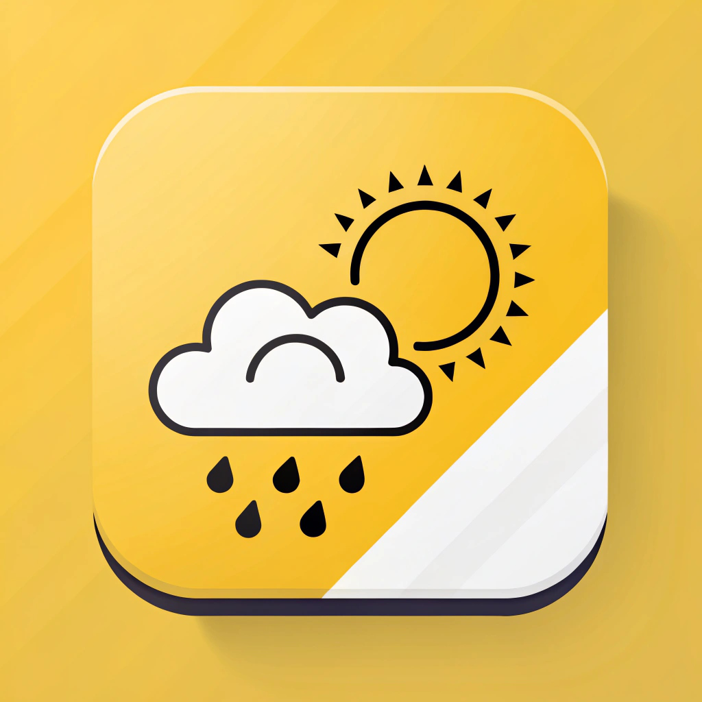
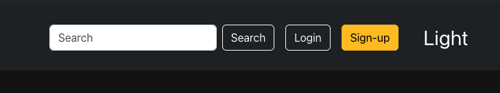
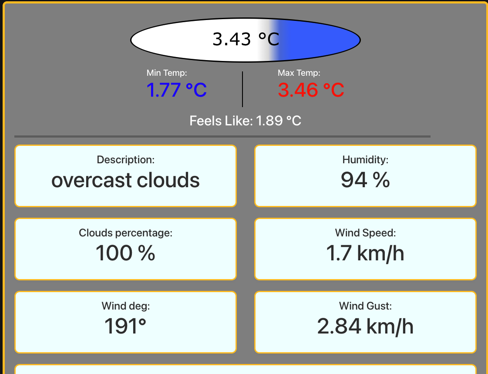
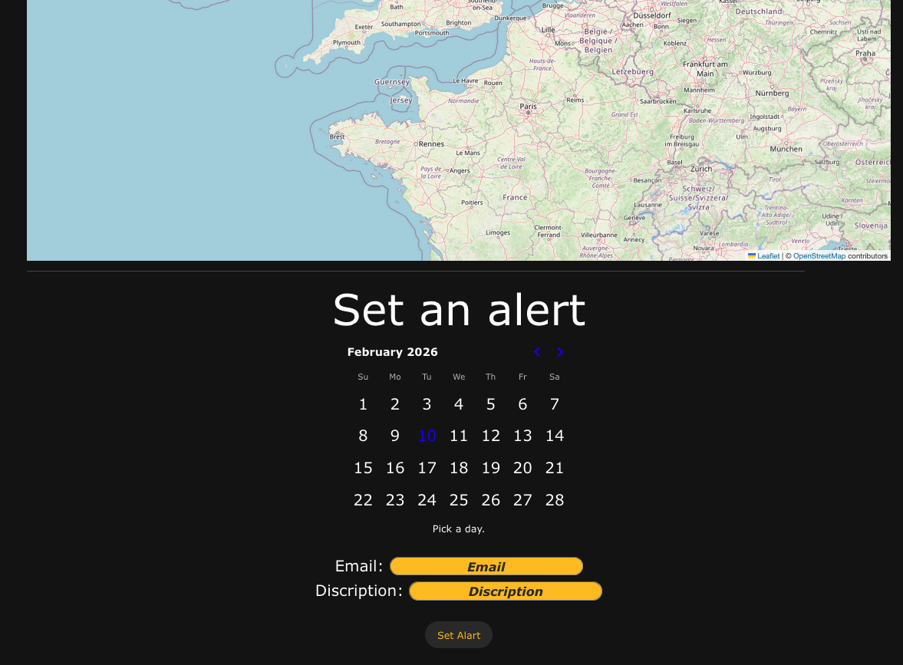

# GetYWeather
<p align="center">
    
</p>

# ❓ What is this

This application is a very simple **weather forecasting application**, with a **lightweight UI** and a **user-friendly, easy to use experience**.

<hr>

Click here 👉 [to navigate to user features](#forusers) <br>
Click here 👉 [to navigate to developer features](#fordevelopers)

# 💻 About this project

Because I attended a vocational school, I had to make a final project, so I chose to make a **weather forecasting application** because this is basically a basic portfolio work for every Full-stack developer.

<hr>

## <a name="forusers"></a>⚡️ Core Features

This application contains several functions, like: 
* 🔍 **Search** – Quickly find weather data for any city worldwide with a clean search interface.
* 🌍 **IP-Based Geolocation** – No need to type; the app automatically detects your location via IP for instant local updates.
* 🗺️ **Interactive Map** – Visualize your exact location and surroundings with the integrated map module.
* 📅 **Smart Notifications** – A date-based system that keeps you informed about the weather that matters to you and a notificion about your desired plans on that day.

## 📦 How to acces

Acces in this 👉 [link](getyweather.netlify.app) <br>
Or <br>
Download the Android application. You find on the right side, in the **releases.** <br>
There is no IOS version because of the bureaucracy of Apple.

## 🤔 How to use

Right here just enter the desired city and press Enter or click on the Search button.

<p align="center">
    
</p>

Here you find the searched city and the exact time of the "county". <br>
Belove this you find the weather datails.

<p align="center">
    
</p>

<p align="center">
    
</p>

This is the map, and alert setting interface.

<p align="center">
    
</p>

<hr>

## <a name="fordevelopers"></a> 🛠️ Developer Guidance

I made it with 0 pervious knowladge about React so please be aware with this while you study the code. 

## 🤬 Design problems

I aware all of this.

* ↕️ **Cursor** There is two cursor on the right in the browser.
* 💿 **Data** I used class for global user datas instead of **Zustand** or **React Context**. (I knew 0 React before this project.)

## 📚 Tech Stack

I used **[Ionic](https://ionicframework.com/)** because my school's requirements stated that we had to create an application that provides cross-platform availability for both web and mobile platforms.

* **[Ionic](https://ionicframework.com/)** (as a meta-framework, this is the base of everythink):
    * **[Capacitor](https://capacitorjs.com/)** (the brindge from web to mobil)
    * **[React](https://react.dev/)** (for the UI)
    * **[Ionic-storage](https://ionicframework.com/docs/angular/storage)** (this is the database)
    * **[Bootstrap](https://getbootstrap.com/)** and **[MDB](https://mdbootstrap.com/)** (for the design)
    * **[Vite](https://vite.dev/)** (build tool)

* API s: 
    * **[OpenWeather](https://openweathermap.org/)** (for the Weather datails)
    * **[OpenStreet](https://www.openstreetmap.org/copyright)** (for the place locations)
    * **[Leaflet](https://leafletjs.com/)** (for the actual map)
    * **[EmailJS](https://www.emailjs.com/)** (this provides the emial sending)
    * **[ip-api](https://ip-api.com/)** and **[ipapi](https://ipapi.co/)** (for the IP adress based location)

* Testing: 
    * **[Jest](https://jestjs.io/)** (integration test)
    * **[Cypress](https://www.cypress.io/#create)** (ent-to-end testing)
    * **[Vitest](https://vitest.dev/)** (UNIT test)

* **[Netlify](https://www.netlify.com/)** as a hosting service for the web page. 

## 👨‍💻 Actual Development

To start develpment just clone this reposiroty. 
```bash
git clone https://github.com/6gDav/GetYWeather.git
```
Or download the ZIP.

Start dev server with this command.
```bash
ionic serve
```

Syncronize with android.
```bash
ionic cap sync android
```

Open in **[Android Studio](https://developer.android.com/studio)**.
```bash
ionic cap open android
```

Problem may occour in this step if the OS don't find the System Varibles for **[Android Studio](https://developer.android.com/studio)** or **[Java](https://www.java.com/en/)**.

Syncronize with IOS.
```bash
ionic cap sync android
```

Problem may occour in this step if the OS don't find the System Varibles for **[Xcode](https://developer.apple.com/xcode/)**.

```bash
npm install
```

May needed to dowland all necesary depencies.

# 🪪 License